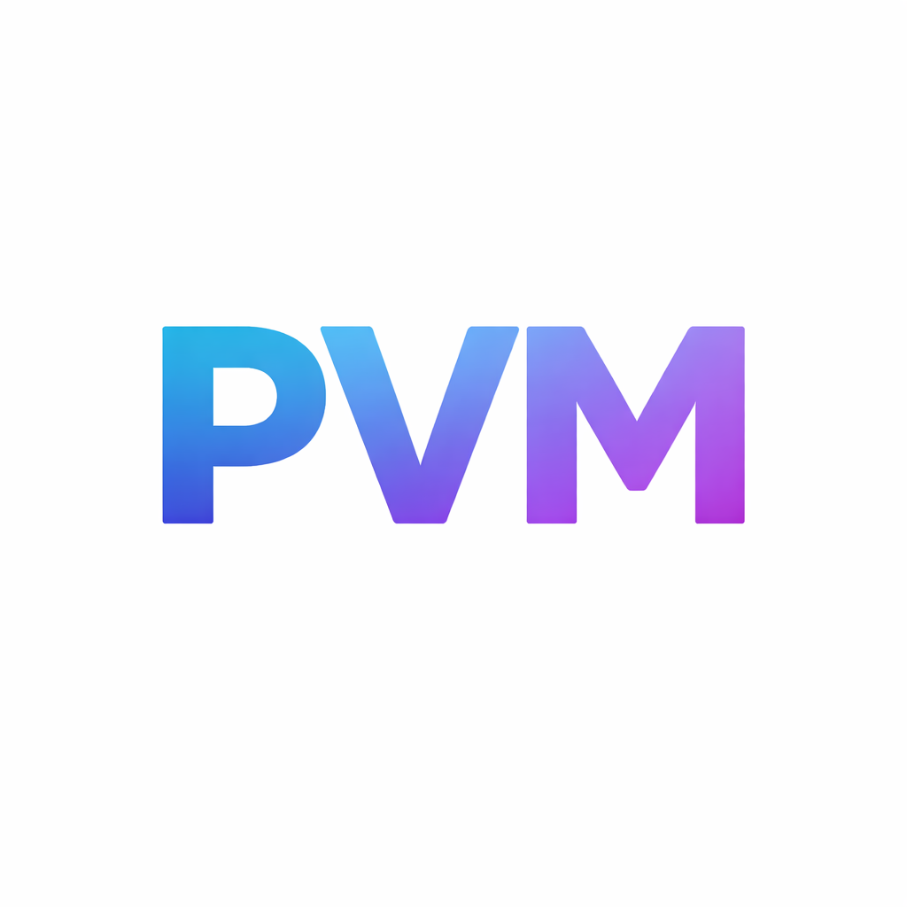

<p align="center">
  
</p>

# PVMount GUI

PVMount GUI is a new macOS-first desktop application that preserves the existing `pvmount` filesystem contract while replacing the original one-shot CLI workflow with a safer local cache, clone support, diagnostics, and a typed desktop UX.

This project does not modify the existing CLI repo. The CLI at [pvmount-tool](https://github.com/sonny-hmcts/pvmount-tool) was used only as behavioral reference.

## What It Does

- Syncs Azure Key Vault environments into a local cache
- Keeps `/mnt/secrets/<namespace>` stable for existing local tooling
- Lets you activate a base environment or a local clone per namespace
- Supports local-only clones for safe secret editing and comparison
- Includes setup checks, diagnostics, activity logs, and Docker mount examples

## Design Decisions

### Mount Strategy

The safest practical first-pass strategy is:

- Maintain the mounted secrets root separately from the managed environment data.
- Keep the application-facing path stable at `/mnt/secrets/<namespace>`.
- On macOS Catalina and later, prepare `/Volumes/mnt/secrets` and only use a temporary one-line `/etc/synthetic.conf` when `/mnt` needs to be repaired.
- Activate an environment by changing one namespace-level symlink:
  - `/Volumes/mnt/secrets/<namespace>` or `/mnt/secrets/<namespace>`
  - points to the selected managed directory under Application Support.

This is safer than per-file symlinks, avoids re-downloading on every environment switch, and keeps the activation blast radius to a single controlled symlink per namespace.

### Local Storage Model

Managed data lives under the Electron user data root:

```text
~/Library/Application Support/pvmount-gui/
  data/
    namespaces/
      <namespace>/
        bases/
          <environment>/
            files/
            metadata.json
        variants/
          <variant>/
            files/
            metadata.json
```

- `bases/<environment>` is the canonical synced copy from Azure.
- `variants/<variant>` is a materialized clone of a base environment.
- Variant metadata records disabled secrets and timestamps.
- Secret states are derived by comparing a variant against its base:
  - `present`
  - `disabled`
  - `changed`

## Architecture

The project is split into explicit layers:

```text
src/
  main/
    ipc/                  Typed IPC registration
    platforms/            macOS implementation + Linux stub contracts
    services/             Azure sync, environment store, privilege service, app controller
    utils/                Errors and structured logging
  preload/                Narrow renderer bridge
  renderer/               Vue 3 UI
  shared/                 Shared TypeScript types and IPC contracts
tests/                    Core non-UI tests
```

Key interfaces:

- `PlatformMountService`
- `SecretSyncService`
- `EnvironmentStore`
- `PrivilegeService`

The renderer does not get shell or filesystem access. All Azure, mount, privilege, and filesystem operations stay in the Electron main process.

## Security Model

- The app does not run as root.
- Azure auth is delegated to the existing Azure CLI session.
- The renderer only talks through typed IPC.
- App startup and dashboard refresh are read-only. Mount repair only runs after an explicit user confirmation.
- The first-pass macOS privilege flow is narrowly scoped:
  - prepare the mount root
  - repair `/mnt` synthetic alias when required
- `/etc/synthetic.conf` handling is defensive:
  - only the exact `mnt /Volumes/mnt` line is supported
  - unmanaged existing content causes the app to stop and require manual review
  - temporary config is removed or restored after applying `apfs.util -t`

Important limitation for the first pass:

- The current macOS elevation flow uses `osascript` with administrator privileges from the main process. This keeps privilege usage narrow, but it is not yet a full `SMJobBless` privileged helper. For long-term distribution, a signed helper is cleaner and should replace this once packaging is hardened.

## UI Surface

The Vue UI currently includes:

- Setup checks
- Namespace and environment dashboard
- Variant creation and deletion
- Secret browser with disable and restore for clones
- Diagnostics
- Structured activity logs

## Development

### Prerequisites

- Node.js 22+
- Azure CLI installed
- `az login` completed for the tenant and subscription you need

### Install

```bash
npm install
```

### Run in development

```bash
npm run dev
```

### Run tests

```bash
npm test
```

## Packaging

This scaffold uses `electron-builder` and is configured for:

- `.dmg`
- `.pkg`

GitHub Actions packaging is available via:

- `.github/workflows/release-macos.yml`

Current release automation is set up to publish the macOS `.pkg` artifact on version tags such as `v0.1.0`.

Recommendation:

- Use `.dmg` for the normal developer distribution path.
- Use `.pkg` if you later introduce a proper privileged helper or need a more managed installation flow.

Tradeoffs:

- `.dmg` is simpler and familiar for desktop apps.
- `.pkg` is better suited to helper installation, managed deployment, and more explicit privilege-related setup.

For notarizable distribution, you should add:

- Apple Developer ID signing configuration
- notarization environment variables and `@electron/notarize`
- if a privileged helper is introduced, a proper signed helper installation path rather than ad hoc elevation

### Build Locally

```bash
npm run package
```

### Create A Release Build In GitHub Actions

Push a version tag:

```bash
git tag v0.1.0
git push origin v0.1.0
```

The workflow will build and attach the macOS installer package to a GitHub Release.

## First-Pass macOS Assumptions

- `/mnt/secrets` must remain the application-facing path for compatibility.
- On Catalina+ the actual writable root is `/Volumes/mnt/secrets`.
- Repairing `/mnt` via synthetic mount alias is acceptable only when tightly controlled and clearly explained to the user.
- Existing non-app-managed `/etc/synthetic.conf` content should never be overwritten automatically.

## What Is Implemented

- TypeScript-only Electron main, preload, shared models, and Vue renderer
- Azure Key Vault sync service using Azure CLI credentials
- File-backed environment store for bases and variants
- Namespace-level activation symlinks
- macOS mount planning and guarded first-pass repair strategy
- Linux service contracts stubbed for future Ubuntu work
- Core tests for environment storage and mount contract behavior

## Next Steps

Recommended follow-up work after this scaffold:

- replace `osascript` elevation with a proper macOS privileged helper
- add namespace creation/import UX
- add variant rename in the UI
- add more detailed sync failure diagnostics and retry behavior
- add signed/notarized CI packaging
